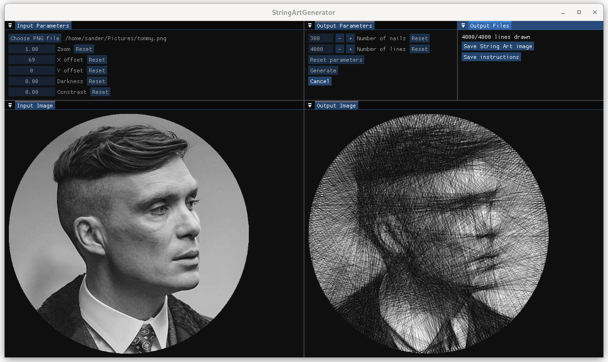

# String Art

This C++ program generates String Art for a given input image in PNG format using [Dear ImGui](https://github.com/ocornut/imgui). The user can modify the input image to their liking by cropping and changing the darkness and constrast of the image. The number of nails on the circle and the number of lines to be drawn can also be specified. After the image is generated, the user can save the output image and a text file with the nail sequence. The applications only runs on Linux.

## Installation

Make sure a C++ compiler, [CMake](https://cmake.org/) and [GLFW](https://www.glfw.org/) are installed on your machine. On Debian, one could use these commands:

- `sudo apt install build-essential`
- `sudo apt install cmake`
- `sudo apt install libglfw3-dev`

## Usage

Choose a target image by selecting a file via the button on the top left. Using the sliders, you can modify the target image. By double clicking on a slider, you can type in an exact value. On the "Output Parameters" panel, you can alter the number of nails and the number of lines. Click on "Generate" to generate the String Art image. When the output image is generated, you can save this image and a text file containing the sequence of nails.

